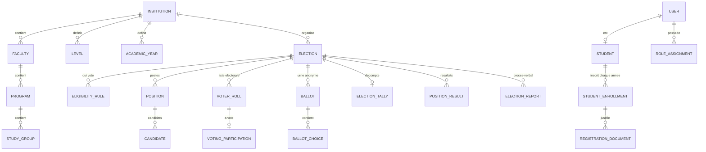

# 02 — Modèle de données

## Plateforme de gestion des élections étudiantes

**Version :** 1.0
**Date :** 08/10/2026
**Statut :** Proposition — à valider avant développement
**Fichier associé :** `backend/prisma/schema.prisma` (source de vérité technique, unique : pas de copie dans `docs/`)
**Base :** MySQL 8 (InnoDB, utf8mb4) + Prisma

---

## 1. Objectif

Ce document définit les tables, relations et contraintes de la plateforme. Il garantit en priorité trois choses, **au niveau de la base de données** et pas seulement dans le code :

1. **Éligibilité** : seul un étudiant vérifié, inscrit sur la liste électorale, peut voter.
2. **Vote unique** : un étudiant ne peut voter qu'une fois par élection, même avec des requêtes simultanées.
3. **Secret du vote** : aucune donnée ne permet de relier un bulletin à un étudiant.

---

## 2. Conventions

| Règle | Détail |
|---|---|
| Identifiants | UUID v4 aléatoires, `CHAR(36)`. Pas d'auto-incrément sur les données liées au vote. |
| Multi-institution | Toute ressource institutionnelle porte `institution_id`. |
| Noms | Modèles Prisma en PascalCase, tables en snake_case (`@@map`). |
| Dates | Stockées en UTC. Converties à l'affichage. |
| Suppression | Pas de suppression physique des données électorales. Statuts (`CANCELLED`, `revokedAt`, `deletedAt`). |
| Fichiers | Contenu dans S3 privé. MySQL ne garde que les métadonnées (`stored_files`). |
| Migrations | Toute modification passe par `prisma migrate`. |

---

## 3. Vue d'ensemble



**Point clé :** il n'existe **aucun lien** entre `VOTING_PARTICIPATION` (domaine identité) et `BALLOT` (domaine urne). Les deux ne se rejoignent qu'à travers `ELECTION`.

---

## 4. Tables par domaine

### 4.1 Identité et accès

| Table | Rôle | Contraintes clés |
|---|---|---|
| `users` | Compte de connexion (étudiant ou admin) | `email` unique, `phone` unique, mot de passe hashé |
| `role_assignments` | Rôle + portée (institution, élection) | Plusieurs rôles par utilisateur, révocables (`revokedAt`) |
| `refresh_tokens` | Sessions | Seul le **hash** du token est stocké ; `familyId` pour révoquer une chaîne compromise ; `twoFactorVerifiedAt` = dernière 2FA de la session (step-up < 10 min, D-18) |

Champs d'authentification ajoutés au Sprint 2 (D-15, D-18) :

- `users.setupTokenJti` : identifiant (`jti`) du seul jeton de configuration 2FA valide pour ce compte. Posé à la connexion d'un administrateur sans 2FA, effacé à l'activation de la 2FA : le jeton est donc à usage unique, et un nouveau jeton invalide le précédent ;
- `refresh_tokens.twoFactorVerifiedAt` : date de la dernière vérification TOTP de la session ; recopiée à chaque rotation du refresh token ; lue par le `StepUpGuard`.

Portée des rôles :

| Rôle | `institutionId` | `electionId` |
|---|---|---|
| SUPER_ADMIN | null | null |
| INSTITUTION_ADMIN | requis | null |
| VERIFICATION_OFFICER | requis | null |
| ELECTION_COMMITTEE | requis | requis |
| STUDENT | requis | null |

### 4.2 Structure académique

```text
Institution
 ├── Faculty (Faculté)
 │    └── Program (Filière)
 ├── Level (L1, L2, L3, M1…)
 ├── AcademicYear (2026-2027)
 └── Group = Program + Level + AcademicYear + nom ("B")
```

Choix :

- **Les niveaux sont des données**, pas un enum, car chaque institution a sa propre nomenclature.
- **Un groupe dépend de l'année** : le groupe B de L3 Droit privé 2026-2027 n'est pas celui de 2027-2028.
- **Départements** : non modélisés au MVP. Ils s'ajouteront entre Faculty et Program si une institution en a besoin.

### 4.3 Étudiants et vérification

| Table | Rôle |
|---|---|
| `students` | Identité stable : numéro étudiant, nom. Unique par `(institutionId, studentNumber)`. |
| `student_enrollments` | Inscription pour **une année** : faculté, filière, niveau, groupe, statut. Unique par `(studentId, academicYearId)`. |
| `stored_files` | Métadonnées des fichiers S3 : clé, type MIME, taille, SHA-256. |
| `registration_documents` | Attestation déposée, résultat OCR (Phase 2), décision du vérificateur. |

**Pourquoi séparer `students` et `student_enrollments` ?** Un étudiant change de niveau et de groupe chaque année. L'éligibilité dépend de l'inscription vérifiée **de l'année de l'élection**, pas d'un profil qui serait écrasé.

Numéro étudiant (D-22) : `students.studentNumber` est nullable. Il est libéré (mis à `NULL`) par un rejet de code `WRONG_STUDENT_NUMBER` (`student_enrollments.rejectionCode`) ou par expiration d'une réservation non vérifiée ; `students.numberClaimedAt` date la réservation. Un numéro d'une inscription `VERIFIED` n'est jamais libéré.

Cycle d'une inscription :

```text
PENDING ──(vérificateur)──► VERIFIED ──(fin d'année)──► EXPIRED
   │
   └──────────────────────► REJECTED (motif obligatoire)
```

### 4.4 Élections

| Table | Rôle | Contraintes clés |
|---|---|---|
| `elections` | Élection, calendrier, statut | Liée à une institution et une année universitaire |
| `eligibility_rules` | Qui peut voter | Voir §5 |
| `positions` | Postes à pourvoir | `seats` (élus), `maxChoices`, `allowBlank` |
| `candidates` | Candidatures | Unique par `(positionId, studentId)` ; statut validé par le comité |

Exemple : *Bureau de promotion L3 Droit privé* contient trois positions (Président, Vice-président, Secrétaire). Un seul bulletin couvre les trois.

---

## 5. Moteur d'éligibilité

### Sémantique des règles

- Une **règle** = ET entre ses critères non nuls.
- Plusieurs règles pour une même élection = OU.
- Un critère nul = « peu importe ».
- Toujours limité à l'institution et à l'année universitaire de l'élection, et aux inscriptions `VERIFIED`.

| Élection | Règle(s) |
|---|---|
| Président groupe B | `program = Droit privé, level = L3, group = B` |
| Président de promotion L3 Droit privé | `program = Droit privé, level = L3` |
| Représentants L3 Droit (deux filières) | `program = Droit privé, level = L3` **OU** `program = Droit public, level = L3` |
| Conseil étudiant de la faculté | `faculty = Droit` |
| Union étudiante | règle vide (toute l'institution) |

### Requête équivalente

```sql
SELECT e.student_id, e.id AS enrollment_id
FROM student_enrollments e
JOIN eligibility_rules r ON r.election_id = :electionId
WHERE e.institution_id   = :institutionId
  AND e.academic_year_id = :academicYearId
  AND e.status = 'VERIFIED'
  AND (r.faculty_id IS NULL OR r.faculty_id = e.faculty_id)
  AND (r.program_id IS NULL OR r.program_id = e.program_id)
  AND (r.level_id   IS NULL OR r.level_id   = e.level_id)
  AND (r.group_id   IS NULL OR r.group_id   = e.group_id)
GROUP BY e.student_id, e.id;
```

### Gel de la liste électorale

À l'ouverture du vote, le résultat de cette requête est copié dans `voter_roll` et `elections.voterRollFrozenAt` est renseigné.

Pourquoi figer :

- le nombre d'électeurs éligibles devient un chiffre fixe pour le procès-verbal ;
- une vérification tardive ne modifie pas silencieusement le corps électoral ;
- le taux de participation est calculable à tout moment.

Ajouter un électeur après le gel est une opération exceptionnelle, réservée au comité et tracée dans `audit_logs`.

**Candidats :** un candidat doit être éligible à l'élection. Vérification faite par le service au dépôt de la candidature, puis à sa validation.

---

## 6. Vote secret — conception détaillée

### 6.1 Deux domaines séparés

```text
DOMAINE A — IDENTITÉ                      DOMAINE B — URNE
(qui a le droit, qui a voté)              (pour qui)

voter_roll                                ballots
  election_id ─┐                            id  (UUID aléatoire)
  student_id   │ PK composite               election_id
               │                          ballot_choices
voting_participations                       ballot_id
  election_id ─┤ PK composite               position_id
  student_id   │ = vote unique              candidate_id (NULL = blanc)
  voted_at     ┘
                     AUCUN LIEN ENTRE A ET B
```

### 6.2 Règles strictes de l'urne

Les tables `ballots` et `ballot_choices` :

1. ne contiennent **aucune** colonne `student_id`, `user_id`, IP, user-agent ou session ;
2. ne contiennent **aucun horodatage** (sinon on rapproche `voted_at` et l'heure du bulletin) ;
3. utilisent des **UUID v4 aléatoires** (un auto-incrément révèle l'ordre d'insertion, donc le votant) ;
4. n'ont **aucune clé étrangère**, directe ou indirecte, vers `voting_participations` ou `students`.

Le `ballot_reference` et le `created_at` du §12 de `01-ARCHITECTURE.md` sont donc **retirés** : l'identifiant aléatoire suffit, et l'horodatage casse l'anonymat.

### 6.3 Transaction de vote

Tout se passe dans **une seule transaction** :

```text
BEGIN
 1. Lire l'élection : status = VOTING_OPEN
    et NOW() (heure de la base) entre votingStartsAt et votingEndsAt
 2. Vérifier l'entrée voter_roll (electionId, studentId)
 3. INSERT voting_participations (electionId, studentId)
      → violation de clé primaire = déjà voté → ROLLBACK → HTTP 409
 4. Valider les choix :
      - chaque position appartient à l'élection
      - chaque candidat est APPROVED et appartient à sa position
      - nombre de choix ≤ maxChoices ; pas de doublon
      - blanc autorisé seulement si allowBlank
      - toutes les positions sont présentes (blanc explicite sinon)
 5. INSERT ballots + ballot_choices
COMMIT
```

Garanties obtenues :

| Risque | Protection |
|---|---|
| Deux requêtes simultanées du même étudiant | Clé primaire `(electionId, studentId)` : MySQL rejette la seconde |
| Vote d'un non-inscrit | Clé étrangère `voting_participations → voter_roll` |
| « A voté » sans bulletin, ou bulletin sans « a voté » | Transaction unique : tout ou rien |
| Vote hors délai | Contrôle du statut et de l'heure **de la base** dans la transaction |
| Bulletin pour un candidat non validé | Contrôle applicatif à l'étape 4 |
| Retry réseau après un vote réussi | Le second envoi reçoit 409 « déjà voté » : comportement idempotent pour l'utilisateur |

Le contrôle `if (hasVoted)` en amont reste utile pour l'interface, mais **la clé primaire est la vraie protection**.

### 6.4 Invariant d'intégrité

À tout moment, et obligatoirement à la clôture :

```text
COUNT(voting_participations) = COUNT(ballots)   pour une élection
COUNT(voting_participations) ≤ COUNT(voter_roll)
```

Le résultat est enregistré dans `election_tallies.integrityOk`. Si l'invariant échoue, les résultats ne sont pas publiés et le comité est alerté.

### 6.5 Modèle de menace — ce qui est protégé, et ce qui ne l'est pas

Il faut être honnête sur les limites du MVP.

| Acteur | Peut-il savoir pour qui X a voté ? |
|---|---|
| Admin de l'institution, comité, vérificateur (via l'application) | **Non.** Aucune API ni écran ne relie identité et bulletin. |
| Développeur qui lit les tables de production | **Non** à partir des tables seules, grâce aux règles du §6.2. |
| Administrateur MySQL ayant accès au **binlog**, au **general log** ou aux logs de requêtes | **Potentiellement oui** : les deux INSERT de la même transaction y apparaissent ensemble. |
| Personne capable d'observer le serveur pendant le vote (mémoire, logs applicatifs) | **Potentiellement oui.** |

Mesures pour le MVP :

- `general_log` désactivé en production ;
- binlog à durée de rétention courte, accès restreint, jamais exporté en dehors des sauvegardes chiffrées ;
- aucun log applicatif contenant à la fois l'utilisateur et les choix (filtrer le body de `POST /voting/.../ballot`) ;
- accès SQL direct en production limité à deux personnes nommées, tracé.

**Évolution possible (post-MVP) :** pour supprimer la confiance envers l'administrateur de la base, il faudra un protocole cryptographique (par exemple jetons à signature aveugle, ou urne sur un service séparé). C'est une revue de sécurité dédiée, prévue dans `04-ELECTION-VOTING-FLOW.md`.

### 6.6 Petits effectifs

Dans un groupe de 25 étudiants, des résultats trop détaillés peuvent révéler des votes. Règles :

- résultats publiés **par position uniquement**, jamais ventilés par groupe, niveau ou filière à l'intérieur d'une élection ;
- aucune statistique de participation **par heure** visible avant la clôture si l'élection compte moins de 50 électeurs ;
- l'interface rappelle cette limite au comité quand il crée une élection de moins de 10 électeurs.

---

## 7. Cycle de vie d'une élection

```text
DRAFT ─► CANDIDACY_OPEN ─► CANDIDACY_CLOSED ─► VOTING_OPEN ─► VOTING_CLOSED ─► RESULTS_PUBLISHED
  │            │                  │                  │
  └────────────┴──────────────────┴──────────────────┴──► CANCELLED
```

| Transition | Effet en base | Verrou |
|---|---|---|
| → VOTING_OPEN | Création de `voter_roll`, `voterRollFrozenAt` | Règles, positions et candidats deviennent non modifiables |
| → VOTING_CLOSED | Automatique à `votingEndsAt` (tâche planifiée) | Plus aucune insertion dans `voting_participations` |
| Décompte | Création de `election_tallies` et `position_results` | Calcul unique, contrôle de l'invariant |
| → RESULTS_PUBLISHED | Résultats visibles ; génération du procès-verbal | Résultats non modifiables |

Chaque transition est enregistrée dans `audit_logs`. Une élection sans vote peut passer de `DRAFT` à `VOTING_OPEN` directement si aucune candidature libre n'est prévue (candidats saisis par le comité).

---

## 8. Résultats et procès-verbal

| Table | Contenu |
|---|---|
| `election_tallies` | Électeurs, participants, bulletins, `integrityOk`, empreinte SHA-256 de l'urne |
| `position_results` | Voix par candidat et par position, ligne « blancs » (`candidateId` NULL), rang, élu |
| `election_reports` | PDF du procès-verbal (fichier S3), code de vérification (QR), SHA-256 du PDF |

**Empreinte de l'urne** (`ballotsDigest`) : SHA-256 calculé sur la liste triée des bulletins et de leurs choix. Elle figure dans le procès-verbal. Toute modification ultérieure de l'urne devient détectable en recalculant l'empreinte.

**QR code :** il contient uniquement `verificationCode`. La page publique de vérification affiche l'élection, la date, les totaux et le hash du PDF, sans aucune donnée personnelle.

---

## 9. Journal d'audit

`audit_logs` enregistre les opérations sensibles : validation d'étudiant, création et ouverture d'élection, validation de candidat, changement de rôle, génération de rapport, ajout exceptionnel à la liste électorale.

Protections :

- **ajout seul** : l'utilisateur MySQL de l'application n'a que `INSERT` et `SELECT` sur cette table ;
- **chaîne de hachage** : chaque ligne contient `hash = SHA-256(prevHash + contenu)`. Supprimer ou modifier une ligne casse la chaîne ;
- **pas de bifurcation** : `prevHash` est unique (D-19). La première ligne a pour `prevHash` 64 zéros (jamais NULL). Deux écritures concurrentes ne peuvent pas prendre la même place : la perdante relit le dernier hash et réessaie. Aucun verrou ni droit `UPDATE` n'est nécessaire ;
- **jamais** de choix de vote, même sous forme de métadonnée. Le vote lui-même n'est **pas** audité nominativement : seule la participation existe, dans `voting_participations`.

Ici l'auto-incrément est volontaire : l'ordre des événements administratifs doit être visible.

---

## 10. Sécurité des données

| Donnée | Traitement |
|---|---|
| Mot de passe | Hash Argon2id (ou bcrypt), jamais réversible |
| Secret 2FA | Chiffré par l'application (AES-256-GCM), clé hors base |
| Refresh token | Hash SHA-256 uniquement |
| IP dans l'audit | Hash avec sel secret (`ipHash`), jamais en clair |
| Attestations d'inscription | S3 privé, accès par URL signée de courte durée |
| Données OCR | Supprimées ou anonymisées après décision du vérificateur (politique à fixer) |

### Comptes MySQL séparés

| Compte | Droits | Usage |
|---|---|---|
| `app_migrate` | DDL complet | `prisma migrate deploy` uniquement, en CI |
| `app_runtime` | DML sur les tables métier ; `INSERT, SELECT` seulement sur `audit_logs` ; pas de `UPDATE/DELETE` sur `ballots`, `ballot_choices`, `voting_participations` | Application NestJS |
| `app_readonly` | `SELECT` sans `ballots`, `ballot_choices` | Rapports, support |

Ces droits sont fixés par un script SQL versionné à côté des migrations Prisma, car Prisma ne gère pas les `GRANT`.

---

## 11. Index et performance

Les index principaux sont déclarés dans `backend/prisma/schema.prisma`. Les plus importants :

| Index | Requête servie |
|---|---|
| `student_enrollments (academicYearId, programId, levelId, groupId, status)` | Calcul de l'éligibilité |
| `voter_roll (studentId)` | « Mes élections » pour un étudiant |
| `ballot_choices (positionId, candidateId)` | Dépouillement |
| `elections (status, votingEndsAt)` | Tâche de clôture automatique |
| `audit_logs (institutionId, createdAt)` | Consultation du journal par institution |

Volume attendu au MVP : quelques milliers d'étudiants, quelques dizaines d'élections par an. MySQL n'aura aucune difficulté. Pas de cache ni de Redis nécessaires.

---

## 12. Écarts par rapport à 01-ARCHITECTURE.md

| Proposé avant | Retenu | Raison |
|---|---|---|
| `voter_eligibility` | `voter_roll` | Liste figée à l'ouverture, plus simple à auditer |
| `voting_authorizations` | `voting_participations` | L'autorisation est vérifiée **dans** la transaction ; pas besoin d'un jeton séparé au MVP |
| `ballots` avec `ballot_reference`, `created_at` | `ballots` + `ballot_choices`, sans horodatage | Un bulletin couvre plusieurs postes ; l'horodatage casse l'anonymat |
| `student_verifications` | Statut porté par `student_enrollments` + `registration_documents` | Évite une table redondante |
| `election_rules` | `eligibility_rules` | Nom plus explicite |
| `election_positions` | `positions` | — |
| `candidate_documents` | `stored_files` liés à `candidates` | Gestion de fichiers unique |
| `election_results` | `election_tallies` + `position_results` | Totaux séparés des résultats par candidat |
| `departments` | Reporté | Pas nécessaire au MVP |

Ces écarts doivent être reportés dans `01-ARCHITECTURE.md` (§12 notamment) lors de sa validation.

---

## 13. Décisions prises (voir 00-DECISIONS.md)

| Réf. | Décision | Effet sur le schéma |
|---|---|---|
| D-01 | Égalité de voix → second tour | `elections.parentElectionId` + `round` |
| D-05 | Un seul poste par étudiant et par élection | `candidates @@unique([electionId, studentId])` |
| D-06 | Vote blanc oui, vote nul non | Aucun (`allowBlank` existant) |
| D-07 | Attestations supprimées 12 mois après la fin de l'année ; données OCR effacées à la décision | Tâche planifiée ; `stored_files.deletedAt` |
| D-08 | Inscription sans groupe acceptée | Aucun (`groupId` nullable) |

---

## 14. Prochaines étapes

1. Lancer `npx prisma validate` puis `npx prisma migrate dev --name init` sur une base MySQL locale (Docker).
2. Écrire le script SQL des comptes MySQL (§10).
3. Rédiger `03-ROLES-PERMISSIONS.md` (matrice rôle → ressource → action).
4. Rédiger `04-ELECTION-VOTING-FLOW.md`, avec la revue de sécurité du vote et les tests de concurrence à écrire.
